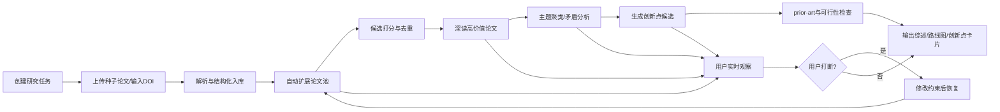

# 01. PRD —— Research OS 产品需求文档

版本：v1.0  
日期：2026-03-16  
状态：可进入立项评审 / 架构评审 / Sprint 规划  
适用对象：产品经理、技术负责人、架构师、前后端、算法、测试、平台工程

---

## 1. 文档目标

本文档定义 Research OS 的产品目标、范围、核心用户场景、功能需求、非功能需求、交互与验收标准，作为研发实施与上线验收的依据。

Research OS 的目标不是替代研究人员发表结论，而是让系统**自主完成大部分科研检索、阅读、结构化分析和创新点探索工作**，而用户只需：

- 提供研究方向和种子论文
- 实时观察进度
- 在必要时中断、修改约束或批准敏感动作
- 最后审阅输出结果

---

## 2. 背景与问题定义

### 2.1 当前痛点

当前多数“AI 科研助手”仍然停留在以下几类能力：

1. **一次性问答**  
   能回答问题，但不能持续执行多阶段研究任务。

2. **检索增强聊天**  
   能查论文和摘要，但不能把内容结构化沉淀成长期可复用的研究知识库。

3. **需要频繁人工接力**  
   每一步都要用户确认“继续吗”“要不要再查”“要不要加几篇”。

4. **缺少证据链**  
   总结往往来自模型自由生成，不能严格回溯到论文段落。

5. **创新点质量不稳定**  
   很多所谓“创新点”只是把几个热门词拼在一起，既没有 prior-art 检查，也没有反证分析。

### 2.2 本产品要解决的问题

Research OS 需要把“科研阅读和文献分析”从聊天动作升级为**操作系统式长任务**：

- 以研究问题为中心，而不是以会话轮次为中心
- 支持几十分钟到数小时的自动执行
- 过程可审计、可打断、可恢复
- 输出不仅是总结，更包括：
  - 证据图谱
  - 主题聚类
  - 矛盾与盲点
  - 创新点假设
  - 后续实验建议

---

## 3. 产品愿景与定位

### 3.1 产品愿景

打造一个面向科研探索的自治系统，使用户可以像提交作业一样提交研究任务，系统自动完成：

- 论文解析与结构化入库
- 引用扩展与主题扩展
- 相关工作覆盖
- 深度总结与争议识别
- 创新点生成与批判
- 实验路线草案

### 3.2 产品定位

Research OS = **自动科研工作流平台 + 证据化研究知识库 + 实时观察和中断控制台**

它不是：

- 单纯的“论文问答机器人”
- 一次性综述生成器
- 只基于向量检索的 RAG 聊天系统
- 只输出结果、不保留过程的黑盒 Agent

### 3.3 产品原则

1. **默认自动**：除非命中策略，否则系统自动继续执行
2. **证据优先**：任何总结、比较、创新点必须有 evidence
3. **可恢复**：长任务崩溃后能从 checkpoint 恢复
4. **可解释**：能回答“为什么找这篇论文”“为什么给出这个创新点”
5. **人只做高价值干预**：不是每一步都人工点按钮
6. **分层成本控制**：昂贵模型只用在高价值步骤

---

## 4. 目标用户与角色

### 4.1 主要用户角色

| 角色 | 典型诉求 | 对系统的核心要求 |
|---|---|---|
| 研究员 / 博士生 | 快速摸清某一方向，挖空白点 | 自动扩展相关工作，输出可追溯综述与创新点 |
| 研究负责人 / PI | 监督课题、比较方向优先级 | 能看到研究覆盖度、关键路线图、风险点 |
| 算法工程师 | 落地一个新技术方案 | 需要结构化方法对比、实验设置、复现线索 |
| 投研 / 技术战略人员 | 快速理解技术生态 | 需要高层总结、关键节点论文、时间线与趋势 |
| 平台管理员 | 稳定运行系统 | 需要配额、追踪、权限、可观测性与审计 |

### 4.2 使用前提

用户至少提供以下其一：

- 研究主题 + 关键词
- 种子论文标题 / DOI / arXiv ID
- 上传若干 PDF
- 希望产出的目标形式（综述 / 创新点 / proposal / 实验计划）

---

## 5. 产品目标与非目标

### 5.1 产品目标（Goals）

G1. 用户提交一次研究任务后，系统能够在无人持续操作下完成多阶段研究流程  
G2. 用户可随时查看进度、证据、当前假设与失败原因  
G3. 系统可在任意节点中断与恢复，不需从头开始  
G4. 系统能从种子论文自动扩展相关论文池，且支持引用链、相似论文、网络检索三路并行  
G5. 系统能将论文结构化为长期可复用知识对象（paper / chunk / claim / citation / concept / hypothesis）  
G6. 系统能自动发现研究簇、冲突、盲点与潜在创新方向  
G7. 系统能输出对团队可直接使用的产物：Markdown 报告、证据表、BibTeX、创新点卡片  
G8. 系统具备基础安全、审计、权限与成本控制能力

### 5.2 非目标（Non-goals）

NG1. 不负责自动撰写最终投稿论文全文  
NG2. 不负责自动跑真实实验与算力调度（可在后续版本扩展）  
NG3. 不保证生成的创新点一定为领域内绝对新颖，需要最终人工学术判断  
NG4. 不默认抓取受限版权全文；必须尊重来源许可与开放获取状态  
NG5. 不试图 Day 1 覆盖所有学科；首版重点支持计算机科学 / AI / 信息科学等 PDF 结构较清晰领域

---

## 6. 核心使用场景

### 6.1 场景 A：围绕一个新方向做自治文献调研

用户输入：

- 研究主题：例如“面向多智能体协作系统的长期记忆与自我修正机制”
- 5 篇种子论文 PDF
- 目标：输出综述、关键争议、3~5 个创新点

系统行为：

1. 自动解析种子论文
2. 抽取方法、claim、future work、limitations
3. 扩展引用链和相似论文
4. 深读 top-K 候选论文
5. 建立研究簇与时间线
6. 识别争议与未覆盖区域
7. 生成创新点卡片与实验草案
8. 用户只在需要时中断或加约束

### 6.2 场景 B：围绕已有方向持续跟踪

用户希望每周刷新某个方向的新论文。系统需要：

- 复用历史研究图谱
- 自动摄取新论文
- 标记新 claim 与旧结论冲突位置
- 更新创新点优先级
- 输出变更报告

### 6.3 场景 C：比较多个子方向

用户给出多个候选课题，希望系统比较：

- 各方向论文成熟度
- 是否存在明显空白
- 哪条路线更具“短期可做、长期有价值”的平衡

系统需输出带证据的对比结论，而非主观推荐。

---

## 7. 产品边界与范围

### 7.1 In-scope（首版范围）

- 研究任务创建与配置
- 种子论文摄取
- PDF 解析与结构化入库
- 文献元数据检索与引用扩展
- 相关论文评分、去重、筛选
- 深度阅读与结构化摘要
- 证据图谱与检索
- 聚类、矛盾分析、空白点发现
- 创新点候选生成与批判
- 实时进度、日志、证据查看
- 中断、恢复、修改约束
- Markdown / JSON / CSV / BibTeX 导出

### 7.2 Out-of-scope（首版不做）

- 自动跑 benchmark 实验
- 自动训练模型和调参
- 自动生成 PPT / 投稿稿件完整版
- 学术社交、协作编辑、注释体系完整版
- 全学科通用 parser（如生物医学扫描件、数学公式复杂排版 PDF 等全部覆盖）

---

## 8. 关键交互模式

### 8.1 任务创建

用户填写：

- 研究主题
- 关键词 / 排除词
- 种子论文（标题 / DOI / arXiv / PDF）
- 时间范围
- 偏好来源（如只要高质量会议 / 期刊）
- 输出目标
- 成本 / 时长预算
- 自动暂停策略（默认推荐）

### 8.2 实时观察

用户在运行过程中可看到：

- 当前阶段（ingest / retrieve / read / synthesize / verify）
- 已发现论文数
- 已完成深读数
- 覆盖度 / 饱和度估计
- 当前研究簇
- 高价值矛盾点
- 创新点候选
- 异常、失败与重试信息

### 8.3 中断与恢复

用户可执行：

- `soft pause`：当前节点结束后暂停
- `hard pause`：尽快中断并 checkpoint
- `resume`：继续执行
- `patch constraints`：修改关键词、来源、预算、排除条件后继续
- `approve action`：批准高风险 / 高成本动作
- `blacklist paper`：剔除某篇论文或某类来源
- `pin direction`：锁定某子方向优先深挖

---

## 9. 功能需求（Functional Requirements）

### 9.1 任务管理

| ID | 功能 | 说明 | 优先级 |
|---|---|---|---|
| FR-01 | 创建研究任务 | 支持主题、关键词、种子论文、目标产物、预算与策略配置 | P0 |
| FR-02 | 任务状态机 | 支持 queued/running/paused/failed/completed/cancelled | P0 |
| FR-03 | 运行历史 | 保存每次 Run 的配置、状态、日志、成本、输出 | P0 |
| FR-04 | 断点恢复 | 任务失败后可从最近 checkpoint 恢复 | P0 |
| FR-05 | 任务复用 | 可基于历史 Run 派生新任务 | P1 |

### 9.2 文献摄取与结构化

| ID | 功能 | 说明 | 优先级 |
|---|---|---|---|
| FR-10 | PDF 上传与对象存储 | 保存原始 PDF、hash、来源、权限信息 | P0 |
| FR-11 | PDF 结构化解析 | 抽取标题、作者、摘要、章节、引用、图表标题、段落位置 | P0 |
| FR-12 | 元数据规范化 | 统一 DOI / arXiv / OpenAlex ID / S2 ID / canonical title | P0 |
| FR-13 | Chunk 切分 | 保留 section path、page span、paragraph index、parent-child 关系 | P0 |
| FR-14 | Claim 抽取 | 抽取 result / method / limitation / assumption / future work 等 | P0 |
| FR-15 | Evidence 绑定 | 每个 claim 绑定原文引用和页码 / span | P0 |

### 9.3 自动检索与扩展

| ID | 功能 | 说明 | 优先级 |
|---|---|---|---|
| FR-20 | 引用扩展 | 读取参考文献、被引文献、共引关系 | P0 |
| FR-21 | 相似论文扩展 | 基于元数据与推荐接口扩展候选池 | P0 |
| FR-22 | 查询重写 | 基于主题、claim、方法名、数据集名自动生成多路检索查询 | P0 |
| FR-23 | 多源检索 | 支持 OpenAlex、Semantic Scholar、Crossref、Unpaywall 等 | P0 |
| FR-24 | 去重与合并 | 跨来源合并同一论文不同版本 | P0 |
| FR-25 | 来源可信度标注 | 区分正式发表、预印本、元数据-only、retracted 等 | P0 |

### 9.4 阅读、分析与创新点

| ID | 功能 | 说明 | 优先级 |
|---|---|---|---|
| FR-30 | 深读队列 | 对高分候选论文执行结构化阅读 | P0 |
| FR-31 | 主题聚类 | 自动生成研究簇与标签 | P0 |
| FR-32 | 矛盾识别 | 识别相互冲突结论、边界条件差异与度量不一致 | P0 |
| FR-33 | 盲点发现 | 找到高价值但证据稀薄的区域 | P0 |
| FR-34 | 创新点生成 | 生成候选 hypothesis / innovation cards | P0 |
| FR-35 | 创新点批判 | 做 prior-art 检查、反证检查、可行性检查 | P0 |
| FR-36 | 实验草案输出 | 给出初步 baseline、数据、指标、失败风险 | P1 |

### 9.5 用户观察与审计

| ID | 功能 | 说明 | 优先级 |
|---|---|---|---|
| FR-40 | 实时事件流 | 展示节点执行、重试、耗时、结果摘要 | P0 |
| FR-41 | 证据浏览器 | 可查看某个结论对应的论文段落与引用关系 | P0 |
| FR-42 | 图谱视图 | 可查看论文图、claim 图、主题簇关系图 | P1 |
| FR-43 | 假设工作台 | 查看创新点的支持与反对证据 | P0 |
| FR-44 | 导出功能 | Markdown / JSON / CSV / BibTeX / graph snapshot | P0 |
| FR-45 | 运行审计 | 保存 prompt hash、模型、工具调用和结果 | P0 |

---

## 10. 非功能需求（Non-functional Requirements）

### 10.1 可靠性与可恢复性

| ID | 要求 | 指标建议 |
|---|---|---|
| NFR-01 | 长任务可恢复 | 任意 worker 崩溃后可从 checkpoint 恢复 |
| NFR-02 | 节点幂等 | 同一 step 重放不应产生重复入库和重复 side effects |
| NFR-03 | 至少一次执行容忍 | 允许 at-least-once，但所有写操作需有 idempotency key |
| NFR-04 | 重试机制 | 网络失败、API 429、解析异常需自动退避重试 |

### 10.2 性能与扩展性

| ID | 要求 | 指标建议 |
|---|---|---|
| NFR-10 | 首屏可见性 | 任务启动后 5~15 秒内出现第一批事件 |
| NFR-11 | 可并发运行 | 首版支持 10~30 个并发 Run，后续扩展 |
| NFR-12 | 检索规模 | 单次 Run 可处理 100~1000+ 篇候选元数据 |
| NFR-13 | 深读吞吐 | 可配置并发深读 worker 数量 |
| NFR-14 | 可横向扩容 | 解析、检索、总结 worker 可独立扩容 |

### 10.3 质量与可信度

| ID | 要求 | 指标建议 |
|---|---|---|
| NFR-20 | 引文可追溯 | 输出中的关键结论必须可回溯到 evidence |
| NFR-21 | 结构化输出稳定 | LLM JSON 输出需校验通过率 > 95% |
| NFR-22 | 创新点可信 | 每个 innovation card 必须含支持证据与反证风险 |
| NFR-23 | 低幻觉 | 对无证据结论明确标记为假设或低置信度 |

### 10.4 安全与合规

| ID | 要求 | 指标建议 |
|---|---|---|
| NFR-30 | 数据隔离 | 多租户 / 多项目隔离 |
| NFR-31 | 来源许可尊重 | 仅使用用户上传或合法 OA 获取的全文 |
| NFR-32 | Prompt 注入防御 | 外部文本视为不可信数据，不得越权控制系统 |
| NFR-33 | 审计日志 | 所有外部请求、关键决策和用户干预都要有日志 |

---

## 11. 产品运行模式

### 11.1 自治模式（默认）

系统按照策略自动推进，不逐步等待用户确认。仅在以下情况自动暂停：

- 关键论文无法获得全文，影响主结论可信度
- 检索结果歧义极大，可能跑偏
- 命中高成本动作（如大规模深读）
- 检测到创新点价值高但证据不足，需要二次 prior-art 验证
- 预算 / 时长 / max_tool_calls 触顶
- 发现可能涉及闭源或受限资源

### 11.2 监督模式

用户可以启用更严格策略，在每个高影响节点前审批，例如：

- 批量下载全文
- 将某条 hypothesis 固化为最终输出
- 修改研究边界
- 调整优先级

### 11.3 批处理模式

支持离线长跑任务，例如每周自动刷新某一方向的新论文池。

---

## 12. 典型用户旅程（User Journey）

### 12.1 主流程

### 12.2 关键体验标准

- 创建任务不应要求过多字段，默认策略即可运行
- 进度页要“像看编译日志 + 研究白板”，而不是仅显示 loading
- 用户必须能快速定位：
  - 当前在读哪篇论文
  - 为什么选择它
  - 当前有什么矛盾和新发现
  - 为什么暂停

---

## 13. 信息架构与页面需求

### 13.1 页面一：Task Composer（任务创建页）

核心模块：

- 主题输入
- 关键词 / 排除词
- seed papers 输入区
- PDF 上传区
- 时间范围与来源偏好
- 输出目标
- 预算与自动暂停策略
- “立即开始研究”按钮

### 13.2 页面二：Live Run Console（运行控制台）

核心模块：

- 运行状态条
- 当前节点与当前论文
- 事件流时间线
- 覆盖度 / 饱和度 / 成本面板
- 已发现论文列表
- 错误与重试信息
- Pause / Resume / Patch 按钮

### 13.3 页面三：Evidence Browser（证据浏览器）

核心模块：

- 论文列表
- 章节树
- chunk / claim 列表
- 原文高亮
- 引文上下文
- claim -> evidence -> hypothesis 链路

### 13.4 页面四：Hypothesis Workbench（创新点工作台）

核心模块：

- innovation cards
- 支持证据
- 反对证据
- 相似已有工作
- 新颖性评分 / 可行性评分 / 风险评分
- “要求系统继续验证”操作

### 13.5 页面五：Graph Explorer（Phase 2）

核心模块：

- citation graph
- claim contradiction graph
- topic cluster graph
- filter / path search / bridge papers

---

## 14. 核心产物定义

### 14.1 系统应输出的主要产物

1. **综述报告**
   - 研究问题
   - 相关路线
   - 主要方法对比
   - 关键数据集与指标
   - 争议点
   - 结论与局限

2. **证据表**
   - paper_id
   - claim
   - evidence span
   - supporting / contradicting relation

3. **文献清单**
   - canonical paper record
   - relevance score
   - cluster label
   - read status

4. **创新点卡片**
   - hypothesis
   - why now
   - evidence support
   - prior-art risk
   - experiment outline

5. **研究路线图**
   - 哪些方向成熟
   - 哪些方向值得追
   - 哪些方向风险大

---

## 15. 成功指标（Product KPIs）

### 15.1 效率类

- 用户从输入到拿到第一版结构化结果的时间
- 平均一次 Run 的自动推进比例（无需人工介入的步骤占比）
- 单次研究任务的中断后恢复成功率
- 人均每周可完成的研究方向数量提升

### 15.2 质量类

- 论文解析成功率
- 引用解析与规范化成功率
- 检索相关性（人工标注 Recall@K / Precision@K）
- 关键结论证据覆盖率
- 创新点“可继续推进”人工接受率

### 15.3 平台类

- 平均 Run 成本
- 外部 API 失败率
- Step 重试率
- 任务崩溃恢复率
- 导出成功率

---

## 16. 自动暂停策略（Policy Gates）

系统默认在以下条件触发暂停：

| Gate | 触发条件 | 系统动作 |
|---|---|---|
| PG-01 | 种子论文解析失败率过高 | 暂停并请求用户补充或替换 PDF |
| PG-02 | 关键主题检索结果分散且低相关 | 暂停并建议收窄问题 |
| PG-03 | 高价值关键论文无合法全文 | 暂停并提示 metadata-only 风险 |
| PG-04 | 创新点 prior-art 相似度过高 | 暂停并建议继续深挖或放弃 |
| PG-05 | 成本 / 时长 / tool call 达阈值 | 暂停等待用户决定 |
| PG-06 | 发现 retracted / 低可信来源占比高 | 暂停并告警 |

这些 Gate 必须是“策略驱动的暂停”，而不是“每个步骤都要确认”。

---

## 17. 验收标准（Acceptance Criteria）

### 17.1 MVP 必须满足

1. 用户可以创建一个研究任务并上传 PDF
2. 系统可以对至少 3~10 篇种子论文完成：
   - 解析
   - chunking
   - claim 抽取
   - metadata 规范化
3. 系统可自动扩展至少 30~100 篇候选论文元数据
4. 系统可对 top-K 候选执行深读并生成结构化摘要
5. 系统可输出：
   - 综述 Markdown
   - 论文表 CSV/JSON
   - 3~5 个创新点卡片
6. 每个创新点卡片都必须显示支持证据和反证风险
7. 用户可在运行中暂停、恢复、修改约束
8. 任务异常退出后可恢复
9. 输出中至少 80% 的关键结论有 evidence 引用
10. 系统全程有时间线与审计日志

### 17.2 不满足上线条件的情况

- 无法恢复中断任务
- 输出中的核心结论无法追溯证据
- 去重合并错误严重，导致同一论文多次被读
- 创新点只是自由生成，没有 prior-art 检查
- 进度页看不到系统当前具体在做什么

---

## 18. 风险与假设

### 18.1 关键风险

1. **PDF 解析质量不足**  
   两栏排版、公式、图表会干扰 chunk 质量。

2. **外部数据源不稳定**  
   学术 API 限流、字段不一致、元数据缺失。

3. **模型幻觉**  
   尤其是在创新点生成和矛盾判断阶段。

4. **开放世界无停止条件**  
   文献搜索可无限继续，必须有饱和判定。

5. **成本失控**  
   若对过多论文做全文深读，成本会迅速上升。

6. **版权与来源合规**  
   必须区分用户上传、开放获取、metadata-only 记录。

### 18.2 关键假设

- 首版主要服务英语论文 PDF
- 用户愿意提供至少少量种子论文或关键词
- 团队接受“先做自治流程和证据链，再做复杂图算法”
- 团队允许将外部元数据缓存到本地数据库

---

## 19. 发布建议

### 19.1 MVP 发布标准

- 内测支持 10 个高质量 topic case
- 每个 case 至少 1 名研究人员进行主观验收
- 自动暂停策略能覆盖主要失败模式
- 能输出对研究人员真正有用的“可继续工作”的结果，而不仅是漂亮文本

### 19.2 上线后第一阶段观察指标

- 用户是否频繁在早期阶段中断（说明跑偏）
- 创新点是否被大量标记为“太空泛”
- 哪个步骤最耗时 / 最贵 / 最不稳定
- 哪类来源最经常导致错误

---

## 20. 产品结论

Research OS 的成败，不在于它能不能“像人一样聊天”，而在于它是否能把科研这件事变成一个：

- 可持续执行的长任务
- 有证据约束的分析流程
- 能被用户随时打断和纠偏的自治系统

因此，首版产品必须优先满足三件事：

1. **自动跑起来**
2. **证据沉淀下来**
3. **过程看得见、能打断、能恢复**

后续所有高级能力（更多 graph intelligence、自动 proposal、自动实验设计）都应该建立在这个基础上。
