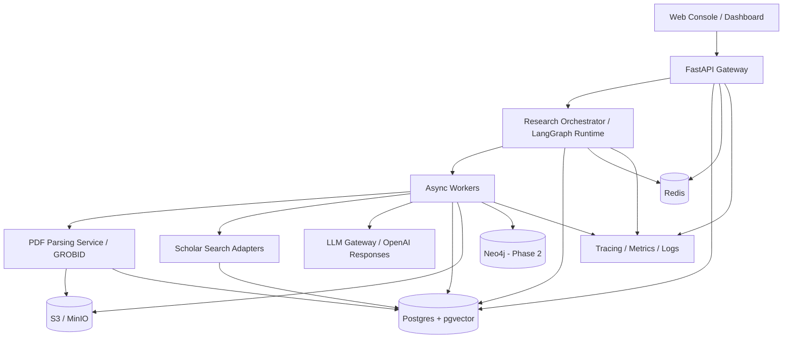
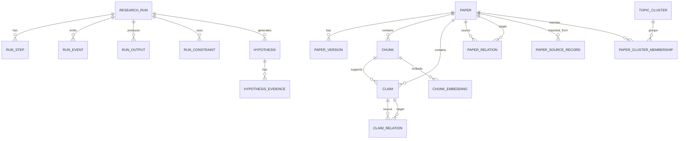
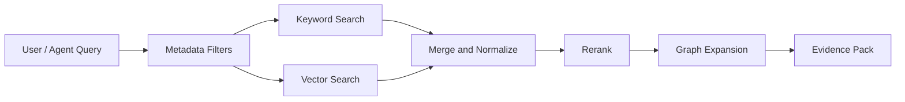

# 02. Architecture and Data Model —— Research OS 系统架构与数据设计

版本：v1.0  
日期：2026-03-16  
适用对象：架构师、后端工程师、数据工程师、平台工程师、算法工程师

---

## 1. 架构目标

Research OS 需要同时满足下面几类要求，这决定了它不能是一个普通的“聊天后端”：

1. **长任务执行**
   - 一次研究任务通常包含几十到几百个步骤
   - 总执行时长可能是几十分钟到数小时
   - 必须支持暂停、恢复、重试、补偿

2. **证据与状态长期保存**
   - 不只是保存对话文本
   - 要保存 paper、chunk、claim、citation、hypothesis、run events 等结构化对象

3. **高审计性**
   - 能回答“为什么找这篇论文”
   - 能回答“为什么系统在这里暂停”
   - 能回答“这个创新点是由哪些证据推出来的”

4. **多层检索与图分析**
   - 既要支持文本向量检索，也要支持关键字过滤、引用图扩展和 claim 图分析

5. **用户实时观察**
   - 运行中要不断推送事件、指标、证据与中间产物

---

## 2. 总体设计原则

### 2.1 控制平面与数据平面分离

- **控制平面（Control Plane）**
  - 研究任务管理
  - 工作流编排
  - 用户中断 / 恢复
  - 预算与策略
  - 可观测性与审计

- **数据平面（Data Plane）**
  - PDF 与对象存储
  - 元数据仓库
  - RAG chunks
  - citation / claim graph
  - embeddings 与检索索引

### 2.2 将“外部世界”视为不可信输入

外部网页、PDF、元数据返回、引用列表全部视为不可信数据。系统必须：

- 不允许这些内容改写系统级指令
- 不直接执行外部文本中的指令
- 对外部返回做 schema 验证
- 明确记录数据来源与许可状态

### 2.3 将“长流程”拆成可重放节点

每个节点都必须具备：

- 明确输入 / 输出 schema
- 幂等键（idempotency key）
- 可 checkpoint
- 可重试
- 有标准错误码与降级策略

---

## 3. 推荐架构决策

## 3.1 首发版本（建议采用）

### 基线技术栈

| 层 | 技术 |
|---|---|
| 前端 | Next.js + TypeScript |
| API 层 | FastAPI |
| 工作流 | LangGraph |
| 状态持久化 | Postgres 16 |
| 向量检索 | pgvector |
| 关键字检索 | Postgres `tsvector` / GIN |
| 缓存 / 队列 | Redis |
| 对象存储 | S3 / MinIO |
| PDF 解析 | GROBID + PyMuPDF |
| 外部学术数据源 | OpenAlex / Semantic Scholar / Crossref / Unpaywall |
| 模型调用 | OpenAI Responses API |
| 可观测性 | OpenTelemetry + tracing + metrics |
| 图分析（Phase 2） | Neo4j |
| 检索扩展（Phase 2） | Qdrant / OpenSearch（按规模演进） |

### 为什么首发推荐 LangGraph

- 它天然适合把 agent 工作流表示成可视化状态图
- 中断、恢复、checkpoint、人工在环都比较直接
- 对 MVP 来说，上手成本明显低于一开始直接全量上 Temporal

### 为什么不建议 Day 1 同时引入太多基础设施

如果首版一口气引入：

- Temporal
- Qdrant
- Neo4j
- Kafka
- 多模型网关
- 多级缓存

会大幅增加研发复杂度，而首版真正要验证的是：

- 研究流程是否闭环
- 证据沉淀设计是否正确
- 创新点生成是否有用
- 用户是否真的愿意“只观察，少介入”

因此建议**首版压栈**，但保留升级接口。

---

## 3.2 生产演进路线（建议在 v1.5+/v2 引入）

当满足以下条件时，建议升级：

- 并发 Run > 50/天
- 单库 chunk 数 > 500 万
- 图分析成为主需求
- SLA / 多租户隔离要求显著提高
- 需要跨团队、跨产品复用 durable workflow

升级方向：

- 工作流：LangGraph -> Temporal（或 LangGraph 内嵌 + Temporal 外编排）
- 检索：Postgres/pgvector -> Qdrant / OpenSearch 混合
- 图分析：Postgres edge tables -> Neo4j projection
- 事件流：Redis -> Kafka / Redis Streams

---

## 4. 逻辑架构图



---

## 5. 服务划分

## 5.1 API Gateway / Application Service

职责：

- 用户鉴权与权限控制
- 研究任务 CRUD
- 文件上传
- 启动 / 暂停 / 恢复 / 取消
- 事件流转发（SSE / WebSocket）
- 导出结果
- 查询历史 Runs、papers、hypotheses

建议：

- FastAPI + Pydantic v2
- 所有输入输出强类型化
- 对外暴露稳定 REST API；内部事件走 Redis / DB / queue

---

## 5.2 Research Orchestrator

职责：

- 维护 Run 状态机
- 决定下一步执行哪个节点
- 触发检索、深读、合成、验证
- 命中 Gate 时暂停
- 处理用户 resume/patch

设计要点：

- 以 `run_id` + `thread_id` 唯一标识执行上下文
- 所有节点必须有可序列化状态
- 使用数据库 checkpointer 存储图状态
- 将非确定性 side effect（HTTP 请求、模型调用、写文件）封装为 task / activity

---

## 5.3 Worker Pool

建议拆成至少 4 类 worker：

1. **ingestion-worker**
   - PDF 解析
   - metadata resolve
   - chunking
   - embedding
   - claim extraction

2. **retrieval-worker**
   - OpenAlex / S2 / Crossref / Unpaywall 查询
   - query rewrite
   - dedup / merge / ranking

3. **synthesis-worker**
   - paper summary
   - clustering
   - contradiction mining
   - gap analysis
   - innovation generation

4. **export-worker**
   - Markdown 报告
   - CSV / JSON / BibTeX 导出
   - snapshot 打包

---

## 5.4 PDF Parsing Service

职责：

- 论文 PDF -> 结构化文档对象
- 返回 section、paragraph、reference、figure/table caption、page span、坐标信息

推荐实现：

- GROBID 负责主结构解析
- PyMuPDF 负责：
  - 原始文本与页码校对
  - 页图预览
  - 局部 fallback 抽取
- 解析结果以 `TEI XML + normalized JSON` 双格式保存

---

## 5.5 Scholar Search Adapter Layer

统一封装以下适配器：

- `OpenAlexAdapter`
- `SemanticScholarAdapter`
- `CrossrefAdapter`
- `UnpaywallAdapter`
- 可选：`ArxivAdapter`、`OpenReviewAdapter`、`PubMedAdapter`

每个 Adapter 输出统一 schema：

```json
{
  "source": "openalex",
  "source_record_id": "W123...",
  "title": "...",
  "doi": "...",
  "abstract": "...",
  "authors": ["..."],
  "year": 2024,
  "venue": "...",
  "citation_count": 123,
  "is_oa": true,
  "oa_url": "https://...",
  "referenced_ids": ["..."],
  "related_ids": ["..."],
  "raw_payload": {}
}
```

---

## 5.6 LLM Gateway

建议做一层统一 Gateway，而不是业务代码直接到处调用模型。

职责：

- 统一接入 OpenAI Responses API
- 模型路由（抽取模型 / 深度总结模型 / 创新点模型）
- 记录 prompt、模型、参数、token、latency
- JSON schema 验证与失败重试
- 可选接入自有 embedding / reranker 模型

必要字段：

- `model_tier`
- `temperature`
- `response_format`
- `timeout`
- `background`（长任务）
- `max_tool_calls`（开放式研究子任务）
- `prompt_hash`

---

## 6. 数据存储设计

## 6.1 存储分层

| 存储 | 用途 | 建议 |
|---|---|---|
| Postgres | 核心业务数据、Run 状态、papers、claims、events | 主数据源 |
| pgvector | chunk embeddings | 先与 Postgres 同库 |
| Postgres tsvector | BM25 / keyword filtering | 与 pgvector 混合 |
| S3 / MinIO | 原始 PDF、TEI XML、导出包 | 对象存储 |
| Redis | 队列、缓存、速率限制、短时状态 | 高速层 |
| Neo4j（Phase 2） | 图分析、复杂路径查询、community detection | 图投影层 |

---

## 6.2 数据模型总览



---

## 6.3 核心表设计

### `research_run`

```sql
create table research_run (
  id uuid primary key,
  workspace_id uuid not null,
  created_by uuid not null,
  title text not null,
  topic text not null,
  status text not null,
  goal_type text not null,
  autonomy_mode text not null default 'default_autonomous',
  budget_json jsonb not null default '{}'::jsonb,
  policy_json jsonb not null default '{}'::jsonb,
  current_step text,
  progress_pct numeric(5,2) default 0,
  started_at timestamptz,
  completed_at timestamptz,
  created_at timestamptz not null default now(),
  updated_at timestamptz not null default now()
);
```

### `run_step`

```sql
create table run_step (
  id uuid primary key,
  run_id uuid not null references research_run(id),
  step_name text not null,
  step_order int not null,
  status text not null,
  attempt int not null default 1,
  input_json jsonb not null,
  output_json jsonb,
  error_code text,
  error_message text,
  idempotency_key text not null,
  started_at timestamptz,
  finished_at timestamptz,
  created_at timestamptz not null default now()
);

create unique index run_step_idempotency_idx
  on run_step(run_id, idempotency_key);
```

### `paper`

```sql
create table paper (
  id uuid primary key,
  canonical_title text not null,
  normalized_title text not null,
  doi text,
  arxiv_id text,
  openalex_id text,
  s2_paper_id text,
  publication_year int,
  venue text,
  abstract text,
  source_trust_score numeric(4,3),
  is_oa boolean,
  oa_url text,
  is_retracted boolean default false,
  primary_language text,
  has_fulltext boolean default false,
  fulltext_status text not null default 'unknown',
  metadata_json jsonb not null default '{}'::jsonb,
  created_at timestamptz not null default now(),
  updated_at timestamptz not null default now()
);

create unique index paper_doi_uidx on paper((coalesce(doi, ''))) where doi is not null;
create index paper_norm_title_idx on paper(normalized_title);
create index paper_year_idx on paper(publication_year);
```

### `paper_source_record`

```sql
create table paper_source_record (
  id uuid primary key,
  paper_id uuid not null references paper(id),
  source_name text not null,
  source_record_id text not null,
  raw_payload jsonb not null,
  fetched_at timestamptz not null default now(),
  unique (source_name, source_record_id)
);
```

### `paper_version`

```sql
create table paper_version (
  id uuid primary key,
  paper_id uuid not null references paper(id),
  version_type text not null, -- preprint/published/revision
  source_url text,
  sha256 text,
  object_key text,
  parse_status text not null default 'pending',
  license_text text,
  page_count int,
  created_at timestamptz not null default now()
);
```

### `chunk`

```sql
create extension if not exists vector;

create table chunk (
  id uuid primary key,
  paper_id uuid not null references paper(id),
  paper_version_id uuid references paper_version(id),
  parent_chunk_id uuid references chunk(id),
  chunk_type text not null, -- abstract/section/paragraph/table_caption/figure_caption/reference_context
  section_path text[],
  paragraph_index int,
  page_start int,
  page_end int,
  char_start int,
  char_end int,
  text text not null,
  token_count int,
  tsv tsvector,
  meta_json jsonb not null default '{}'::jsonb,
  created_at timestamptz not null default now()
);

alter table chunk add column if not exists embedding vector(3072);

create index chunk_paper_idx on chunk(paper_id);
create index chunk_section_idx on chunk using gin(section_path);
create index chunk_tsv_idx on chunk using gin(tsv);
create index chunk_embedding_idx on chunk using hnsw (embedding vector_cosine_ops);
```

### `claim`

```sql
create table claim (
  id uuid primary key,
  paper_id uuid not null references paper(id),
  chunk_id uuid not null references chunk(id),
  claim_type text not null, -- method/result/limitation/assumption/future_work/dataset/metric
  subject_text text,
  predicate_text text,
  object_text text,
  normalized_subject text,
  normalized_object text,
  conditions_json jsonb not null default '[]'::jsonb,
  claim_text text not null,
  polarity text, -- positive/negative/neutral
  confidence numeric(4,3),
  extraction_model text,
  evidence_quote text,
  evidence_page_start int,
  evidence_page_end int,
  created_at timestamptz not null default now()
);

create index claim_paper_idx on claim(paper_id);
create index claim_type_idx on claim(claim_type);
create index claim_subject_idx on claim(normalized_subject);
```

### `paper_relation`

```sql
create table paper_relation (
  id uuid primary key,
  src_paper_id uuid not null references paper(id),
  dst_paper_id uuid not null references paper(id),
  relation_type text not null, -- cites/cited_by/related/recommended/same_author/same_topic
  context_chunk_id uuid references chunk(id),
  confidence numeric(4,3),
  source_name text,
  created_at timestamptz not null default now()
);

create index paper_relation_src_idx on paper_relation(src_paper_id);
create index paper_relation_dst_idx on paper_relation(dst_paper_id);
create index paper_relation_type_idx on paper_relation(relation_type);
```

### `claim_relation`

```sql
create table claim_relation (
  id uuid primary key,
  src_claim_id uuid not null references claim(id),
  dst_claim_id uuid not null references claim(id),
  relation_type text not null, -- supports/contradicts/refines/extends/duplicates
  confidence numeric(4,3),
  rationale text,
  created_at timestamptz not null default now()
);
```

### `hypothesis`

```sql
create table hypothesis (
  id uuid primary key,
  run_id uuid not null references research_run(id),
  title text not null,
  statement text not null,
  type text not null, -- bridge/assumption_relaxation/metric_gap/transfer/negative_result_exploitation
  novelty_score numeric(4,3),
  feasibility_score numeric(4,3),
  evidence_score numeric(4,3),
  risk_score numeric(4,3),
  status text not null default 'candidate',
  summary_json jsonb not null default '{}'::jsonb,
  created_at timestamptz not null default now()
);
```

### `hypothesis_evidence`

```sql
create table hypothesis_evidence (
  id uuid primary key,
  hypothesis_id uuid not null references hypothesis(id),
  evidence_type text not null, -- support/oppose/prior_art/missing_prerequisite
  paper_id uuid references paper(id),
  claim_id uuid references claim(id),
  chunk_id uuid references chunk(id),
  note text,
  weight numeric(4,3),
  created_at timestamptz not null default now()
);
```

### `run_event`

```sql
create table run_event (
  id bigserial primary key,
  run_id uuid not null references research_run(id),
  event_type text not null,
  severity text not null default 'info',
  payload jsonb not null default '{}'::jsonb,
  created_at timestamptz not null default now()
);

create index run_event_run_id_created_idx on run_event(run_id, created_at desc);
```

---

## 6.4 为什么 Day 1 用 Postgres 做主存储

优点：

- 事务一致性强
- 结构化数据、事件日志、运行状态能放在一起
- 团队工程门槛低
- pgvector + tsvector 足够支撑首版混合检索
- 后续仍可以平滑投影到 Qdrant / Neo4j

### 升级条件

如果出现以下情况，考虑拆分：

- chunk > 500 万且检索慢
- 多租户并发高、索引更新压力大
- 图查询复杂度高于关系型表承受范围
- 需要多阶段 hybrid query、rerank 都在引擎侧完成

---

## 7. 检索层设计

## 7.1 首版检索策略：Postgres Hybrid Retrieval

首版即可做四层检索：

1. metadata filter
2. keyword search（`tsvector`）
3. vector search（pgvector）
4. graph expansion（基于 paper_relation / claim_relation 表）

### 查询流程



### 建议做法

- 第一阶段取 `tsvector top_n=200`
- 第二阶段取 `vector top_n=200`
- 合并后去重
- 使用轻量 reranker 重排到 top 50
- 再做 graph expansion 找近邻 papers / claims
- 最终给 LLM 的不是原始结果，而是 evidence pack

---

## 7.2 扩展到 Qdrant（Phase 2）

当规模和并发提升后，可将 chunk embedding 同步到 Qdrant。  
Qdrant 的价值在于：

- 更强的 ANN 检索能力
- server-side hybrid / multi-stage query
- 更适合复杂多向量查询和大规模索引

建议方式：

- Postgres 仍为 source of truth
- Qdrant 为检索加速层
- 通过 CDC / batch sync 同步 chunk 与 embedding

---

## 8. 图层设计

## 8.1 Day 1：关系表足够

首版不必立刻上独立图数据库。只要关系表设计规范，就能完成：

- citation expansion
- claim contradiction mining
- bridge papers 探测
- topic coverage 计算

### 示例查询：找桥接论文

```sql
select p.id, p.canonical_title
from paper p
join paper_relation r1 on r1.src_paper_id = p.id
join paper_relation r2 on r2.src_paper_id = p.id
where r1.relation_type = 'cites'
  and r2.relation_type = 'cites'
  and r1.dst_paper_id <> r2.dst_paper_id;
```

## 8.2 Phase 2：Neo4j 图投影

当需要：

- community detection
- centrality
- shortest path
- multi-hop bridge discovery
- graph-native interactive exploration

时再上 Neo4j。

### 图中建议的节点类型

- `Paper`
- `Claim`
- `Concept`
- `Method`
- `Dataset`
- `Metric`
- `Hypothesis`
- `TopicCluster`

### 建议边类型

- `CITES`
- `SUPPORTS`
- `CONTRADICTS`
- `USES_METHOD`
- `EVALUATED_ON`
- `MEASURES_WITH`
- `BELONGS_TO_CLUSTER`
- `DERIVES_FROM`
- `SIMILAR_TO`

---

## 9. API 设计

## 9.1 外部 REST API

### 创建任务

```http
POST /api/v1/runs
```

请求：

```json
{
  "title": "Long-memory and self-correction in multi-agent systems",
  "topic": "长期记忆与自我修正机制在多智能体系统中的应用",
  "keywords": ["multi-agent", "long-term memory", "self-correction"],
  "exclude_keywords": ["robotics hardware"],
  "seed_papers": [
    {"type": "doi", "value": "10.xxxx/xxxx"},
    {"type": "upload", "file_id": "file_123"}
  ],
  "goal_type": "survey_plus_innovations",
  "budget": {
    "max_runtime_minutes": 90,
    "max_new_papers": 150,
    "max_fulltext_reads": 40,
    "max_llm_cost_usd": 30
  },
  "policy": {
    "auto_pause_on_missing_key_fulltext": true,
    "auto_pause_on_low_confidence_hypothesis": true
  }
}
```

### 查询任务状态

```http
GET /api/v1/runs/{run_id}
```

### 软暂停

```http
POST /api/v1/runs/{run_id}/pause
{
  "mode": "soft"
}
```

### 强暂停

```http
POST /api/v1/runs/{run_id}/pause
{
  "mode": "hard"
}
```

### 恢复任务

```http
POST /api/v1/runs/{run_id}/resume
{
  "patch": {
    "keywords_add": ["reflection"],
    "blacklist_sources": ["blog"]
  }
}
```

### 事件流

```http
GET /api/v1/runs/{run_id}/events/stream
```

### 获取创新点

```http
GET /api/v1/runs/{run_id}/hypotheses
```

### 获取证据包

```http
GET /api/v1/runs/{run_id}/evidence?hypothesis_id=...
```

### 导出

```http
POST /api/v1/runs/{run_id}/export
{
  "formats": ["markdown", "json", "bibtex"]
}
```

---

## 9.2 事件类型定义

建议事件类型：

- `run.created`
- `run.started`
- `run.paused`
- `run.resumed`
- `run.completed`
- `run.failed`
- `seed.ingest.started`
- `seed.ingest.completed`
- `paper.parsed`
- `paper.metadata.resolved`
- `paper.claims.extracted`
- `search.batch.started`
- `search.batch.completed`
- `ranking.completed`
- `deepread.started`
- `deepread.completed`
- `cluster.updated`
- `contradiction.detected`
- `hypothesis.generated`
- `hypothesis.rejected`
- `policy.pause_triggered`
- `budget.threshold_reached`

### SSE Payload 示例

```json
{
  "event_type": "hypothesis.generated",
  "run_id": "run_123",
  "severity": "info",
  "timestamp": "2026-03-16T10:21:10Z",
  "payload": {
    "hypothesis_id": "hyp_789",
    "title": "Use reflective memory compression to stabilize long-horizon multi-agent planning",
    "novelty_score": 0.81,
    "evidence_score": 0.73
  }
}
```

---

## 10. 工作流状态持久化

## 10.1 状态快照策略

对每个节点保存：

- node name
- state before
- state after
- input hash
- output hash
- model/tool metadata
- retry count
- elapsed time

## 10.2 幂等设计

所有可能被重放的节点都需使用幂等键，例如：

- `parse_pdf:{paper_version_id}:{sha256}`
- `resolve_metadata:{normalized_title}:{year}:{first_author}`
- `embed_chunk:{chunk_id}:{embedding_model}`
- `claim_extract:{chunk_id}:{prompt_hash}:{model}`
- `search_openalex:{run_id}:{query_hash}:{page}`
- `rank_candidates:{run_id}:{candidate_set_hash}:{ranking_version}`

---

## 11. 安全、权限与合规

## 11.1 权限模型

最少需要：

- `admin`
- `research_manager`
- `research_user`
- `viewer`

权限点：

- 是否可创建 Run
- 是否可上传文件
- 是否可恢复他人 Run
- 是否可查看原始 PDF
- 是否可导出结果
- 是否可修改全局策略

## 11.2 数据隔离

- 每个 workspace / project 使用逻辑隔离
- 数据库记录都带 `workspace_id`
- 对象存储路径带租户前缀
- 向量索引可按 workspace 分区

## 11.3 来源许可与版权

必须记录：

- 文件来源（user upload / oa download / metadata only）
- license text
- is_oa
- oa_url
- 是否允许重新分发

原则：

- 默认不抓闭源全文
- 无法合法获取全文时，只保留 metadata 与 abstract
- 输出报告引用时应引用论文元数据，不拷贝大段受版权保护全文

## 11.4 Prompt Injection 防御

外部 PDF / 网页 / 摘要都可能含“忽略之前指令”等恶意文本。系统必须：

- 将外部内容只作为 data，不作为 system / developer instruction
- 工具执行层不接受论文内容直接转成函数调用参数
- 关键动作前做 schema filtering
- 对引用片段做长度限制和 sanitization

---

## 12. 可观测性设计

## 12.1 必须采集的指标

### 运行层

- runs_created_total
- runs_completed_total
- runs_failed_total
- runs_paused_total
- run_duration_seconds

### 节点层

- step_latency_seconds
- step_retry_total
- step_failure_total
- queue_wait_seconds

### 数据层

- papers_ingested_total
- chunks_embedded_total
- claims_extracted_total
- duplicates_merged_total

### 模型层

- llm_requests_total
- llm_latency_seconds
- llm_json_validation_failures_total
- llm_cost_estimate_total

### 检索层

- source_api_errors_total
- retrieval_candidates_total
- retrieval_relevance_avg
- coverage_score_avg
- saturation_score_avg

## 12.2 Trace 维度

每个 step trace 至少记录：

- run_id
- step_name
- paper_id / query_id
- model
- prompt_hash
- adapter name
- external request latency
- cache hit / miss
- retry_count

---

## 13. 备份、恢复与灾难处理

### 13.1 必须具备

- Postgres 每日快照 + WAL
- 对象存储版本控制
- 关键运行状态定期备份
- 失败 Run 可重放
- 导出包可作为冷备份

### 13.2 恢复优先级

1. 恢复 research_run、run_step、run_event
2. 恢复 paper / chunk / claim / hypothesis
3. 重建 embedding index
4. 重建图投影

---

## 14. 部署建议

## 14.1 开发环境

- Docker Compose
- 本地 Postgres
- 本地 Redis
- 本地 MinIO
- GROBID 容器
- 前后端分离

## 14.2 测试 / Staging

- 使用云上托管 Postgres
- 限制外部 API 调用额度
- 保留匿名化样本集
- 开启完整 tracing

## 14.3 生产环境

- K8s / ECS / Nomad 均可
- API 与 worker 分开扩容
- GROBID 单独部署
- Postgres 建议托管
- 对象存储启用生命周期策略

### 粗略资源建议（首版）

- API：2~4 vCPU, 4~8 GB RAM
- Worker：4~8 vCPU, 8~16 GB RAM
- GROBID：4 vCPU, 8 GB RAM 起
- Postgres：按数据规模单独评估
- Redis：1~2 GB 即可起步

---

## 15. 演进与替换策略

## 15.1 如果未来迁移到 Temporal

请从 Day 1 做好下面这些准备：

- 节点全部独立成可调用 activity
- side effects 封装到 service 层
- state schema 严格版本化
- 不把业务逻辑深嵌在 LangGraph 节点代码中
- 所有节点输入输出 JSON 化

这样后续迁移只是在“谁调度谁”层面变化，而不是整套系统推翻重写。

## 15.2 如果未来上 Neo4j

- 以 Postgres 为 truth source
- 用定时 / CDC 同步 `paper_relation`、`claim_relation` 等表到 Neo4j
- 不做双写业务真相，避免一致性问题

## 15.3 如果未来上 Qdrant

- 以 chunk / embedding 表为源
- 增量同步到 Qdrant collection
- 保持 `chunk_id` 全局不变
- API 层只依赖统一 Retrieval Service，不直接绑死底层引擎

---

## 16. 架构结论

Research OS 的系统架构要解决的核心不是“怎么堆更多 AI 能力”，而是：

- 如何把开放世界研究任务拆成稳定节点
- 如何把证据沉淀成长期可复用的数据层
- 如何让自治流程能被用户打断、修改、恢复
- 如何在不牺牲可追溯性的前提下输出创新点

因此首版最关键的设计决策是：

1. 以 **LangGraph + Postgres** 构建自治工作流底座
2. 以 **paper / chunk / claim / relation / hypothesis** 作为核心数据对象
3. 以 **Postgres hybrid retrieval** 先打通闭环
4. 以 **可升级的图层与检索层** 预留未来扩展能力

这比 Day 1 上很多“更酷”的组件更重要。
