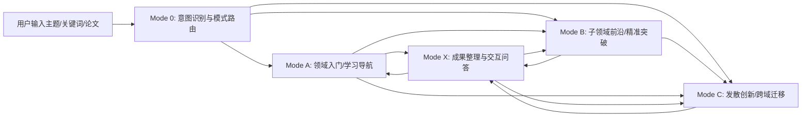

# 06. Multi-Mode Research Agents and Execution Design —— 多模式科研 Agent 与执行设计

版本：v1.0  
日期：2026-03-20  
适用对象：产品经理、PI、算法工程师、Agent 工程师、后端工程师、前端工程师、设计师、测试工程师

---

## 1. 文档目标

本文件在既有 `01_PRD.md`、`02_Architecture_and_Data_Model.md`、`03_Agents_Workflows_and_Prompts.md` 基础上，专门回答以下问题：

1. 面向**不同科研阶段用户**，Research OS 应该如何拆成多个模式（Modes）与子 Agent。  
2. 这几个模式如何**相互调用、相互继承上下文、逐步收敛到具体研究问题**。  
3. 如何把“广泛了解领域”“深入小方向”“跨领域发散创新”这三种科研动作做成可执行的自治流程。  
4. 如何让结果不只是文字，而是**图文并茂**：论文架构图、方法图、时间线、分类树、对比表、mind map、痛点板、创新点卡片。  
5. 如何把系统页面设计成类似“研究工作台”的形式：左侧知识树、右侧研究结果和实时交互区。

本文件建议把原始三种模式正式命名为：

- **Mode A：领域入门 / 学习导航模式（Field Onboarding & Atlas）**
- **Mode B：子领域前沿 / 精准突破模式（Focused Frontier & Gap Analysis）**
- **Mode C：发散创新 / 跨域迁移模式（Divergent Innovation & Cross-Domain Transfer）**

为了让系统更稳，建议再补两个辅助模式：

- **Mode 0：任务意图识别与模式路由（Intake & Router）**
- **Mode X：成果整理与交互问答模式（Synthesis & Interactive Review）**

这样整个 Research OS 就不是单个 Agent，而是一个**面向科研生命周期的模式化操作系统**。

---

## 2. 为什么必须做“多模式”而不是单一 Research Agent

同一个“自动科研系统”，面对三类用户的任务差异极大：

### 2.1 刚入门学生的任务特征

需求通常是：
- 这个领域在研究什么
- 有哪些经典工作、代表路线和演化节点
- 有哪些子方向
- 每个子方向常用什么方法、什么数据集、什么评价指标
- 我应该按什么顺序读
- 哪些论文一定要看图、一定要看实验表

这类任务重点是：
- 覆盖广度
- 认知结构化
- 渐进式教学
- 可视化表达
- 少术语跳跃

### 2.2 已懂大领域、但不懂子方向的学生任务特征

需求通常是：
- 只围绕某个子方向找近期高质量小同行论文
- 不要漫无边际扩散
- 想知道别人解决了什么问题
- 用了什么方法
- 还有哪些痛点没解决
- 我从哪里下手最可能做出工作

这类任务重点是：
- 精准检索
- 强约束召回
- venue / benchmark / citation chain 限制
- 高相关度与高质量优先
- 痛点归纳与 future work 抽取

### 2.3 已熟悉子领域、要找创新点的学生任务特征

需求通常是：
- 本领域痛点已经清楚
- 需要找到可迁移的方法来源
- 需要跨领域 analogical reasoning
- 想从别的方向借方法解决本方向难题
- 需要系统辅助形成新 idea，而不是只总结旧文献

这类任务重点是：
- 痛点抽象
- 问题签名化
- 跨领域召回
- 映射与可行性分析
- prior-art 反查
- 风险与 novelty 平衡

因此，**一个统一系统可以共享底层服务，但前台必须表现为多模式、多路径、多层次输出**。否则：

- 入门用户会被“创新点模式”的复杂度淹没
- 研究型用户会被“入门式概述”浪费时间
- 发散模式会因缺乏约束而胡乱联想

---

## 3. 总体模式架构



### 3.1 模式定位

| 模式 | 适用用户 | 核心目标 | 结果形态 | 主要价值 |
|---|---|---|---|---|
| Mode 0 | 所有用户 | 判断用户现在到底需要“学习”“聚焦”“创新”哪种动作 | 任务配置、模式选择、初始计划 | 降低误触发、减少路线跑偏 |
| Mode A | 刚入门/切换领域的学生 | 帮用户建立结构化领域认知与阅读路径 | 时间线、分类树、读书单、代表图示、mind map | 快速入门，建立认知框架 |
| Mode B | 对大领域已有认知、要做某个小方向 | 找高质量小同行、总结问题与方法、发现痛点 | 子领域综述、方法对比、benchmark 面板、痛点/创新空间 | 提高选题与开题质量 |
| Mode C | 已经确定子方向、要做创新 | 从本领域和外领域找可迁移解法，形成研究想法池 | pain-point abstraction、analogical map、idea cards、实验草案 | 系统化创新探索 |
| Mode X | 所有用户 | 对现有结果进行追问、改写、精修、导出 | 对话式问答、导出报告、精修摘要 | 提高易用性与交互灵活度 |

### 3.2 模式之间的继承关系

- Mode A 输出的**分类树 / 代表路线 / 基础阅读清单**，可以直接成为 Mode B 的输入。  
- Mode B 输出的**子领域定义 / benchmark / 痛点 / future work / 尚未解决问题**，可以直接成为 Mode C 的输入。  
- Mode C 形成的**创新点卡片 / 候选假设 / 迁移方案**，可以再回到 Mode B 去补做相关工作检查。  
- Mode X 作为统一交互层，允许用户对任何模式产物追问、缩范围、重排顺序、导出材料。

---

## 4. 共享底座：所有模式都必须复用的核心能力

这三个模式不能各自为政，必须共享底层知识结构与服务。

## 4.1 共享知识对象

建议在原有数据模型之外，增加以下“学习型 / 研究型对象”：

### 4.1.1 `research_domain`

表示“研究领域”层级对象。

字段建议：
- `domain_id`
- `name`
- `aliases`
- `parent_domain_id`
- `description_short`
- `description_detailed`
- `keywords`
- `representative_venues`
- `representative_datasets`
- `representative_methods`
- `canonical_papers`
- `recent_frontier_papers`
- `prerequisite_domains`

### 4.1.2 `topic_cluster`

表示某个子方向或技术簇。

字段建议：
- `cluster_id`
- `domain_id`
- `name`
- `summary`
- `entry_keywords`
- `papers`
- `methods`
- `datasets`
- `metrics`
- `pain_points`
- `future_work_mentions`
- `coverage_score`

### 4.1.3 `figure_asset`

表示论文中的图示资产，支持图文并茂输出。

字段建议：
- `figure_id`
- `paper_id`
- `source_type`（`pdf_crop` / `arxiv_source` / `publisher_html` / `manual_upload`）
- `page_no`
- `caption`
- `image_path`
- `figure_type`（架构图 / pipeline / 定性结果 / 表格截图 / 方法对比图）
- `related_section`
- `license_note`
- `extraction_confidence`

### 4.1.4 `reading_path`

表示为特定用户生成的学习路径。

字段建议：
- `path_id`
- `user_profile_id`
- `domain_id`
- `difficulty_level`
- `ordered_units`
- `estimated_hours`
- `goal`
- `generated_rationale`

### 4.1.5 `pain_point`

表示系统归纳出的研究痛点。

字段建议：
- `pain_point_id`
- `cluster_id`
- `statement`
- `pain_type`（泛化不足 / 算力高 / 标注难 / 跨模态融合差 / benchmark 不充分 等）
- `supporting_papers`
- `counter_evidence_papers`
- `severity_score`
- `novelty_potential`

### 4.1.6 `idea_card`

表示 Mode C 产生的创新想法卡片。

字段建议：
- `idea_id`
- `title`
- `problem_statement`
- `source_pain_points`
- `borrowed_methods`
- `source_domains`
- `mechanism_of_transfer`
- `expected_benefit`
- `risks`
- `required_experiments`
- `prior_art_check_status`
- `novelty_score`
- `feasibility_score`

---

## 4.2 共享基础服务

### 4.2.1 学术检索服务

建议统一抽象为 `ScholarGateway`，内部调用：
- Semantic Scholar
- OpenAlex
- Crossref
- Unpaywall
- arXiv API
- 本地 corpus / 向量检索 / 主题图谱

其职责：
- 标准化 paper identifier
- 返回统一 paper schema
- 提供引用链、相似论文、推荐论文、benchmark 论文、venue 限定论文
- 提供 source provenance 与检索 trace

### 4.2.2 PDF / Source 解析服务

建议统一抽象为 `DocumentIngestionService`。

输入：
- PDF URL
- 本地 PDF
- DOI
- arXiv ID
- 文章 HTML 页面

输出：
- 结构化段落树
- section/chunk
- figures/tables/captions
- reference list
- key claims / datasets / methods / limitations

### 4.2.3 图像与图示提取服务

建议单独建设 `FigureExtractionService`，因为图文并茂是刚需。

图示提取优先级：
1. **优先使用 arXiv Source 包**（如果存在且允许）获取原始 figure 文件；arXiv 官方说明中，Source 下载通常为 gzipped TeX 或 tar 包，适合内部解析。  
2. 无 Source 时，从 PDF 中做页面级检测、版面分析、区域裁切。  
3. 若文档结构化服务可返回 figure coordinates，则直接裁切。  
4. 对 figure caption 做摘要，给图打标签：架构图、流程图、可视化结果图、表格截图等。  
5. 对图做“讲图”摘要，生成适合学生理解的说明文字。

注意：
- arXiv 官方也说明，大部分 arXiv 论文并不自动授予广泛复用权利，系统应保存 license 信息并优先作为**内部学习展示**用途，不应默认二次公开分发。  
- 前端展示时应明确图来源、论文标题、页码/figure 编号、许可说明。

### 4.2.4 教学化解释服务

建议单独做 `PedagogyService`，负责把学术结果转化为“学生可学”的输出。

功能包括：
- 术语解释层级化
- 先修知识补链
- 读论文顺序建议
- “这篇论文为什么重要”的教学版解释
- 图示辅助讲解
- 常见误解提醒

### 4.2.5 创新检验服务

建议单独做 `IdeaValidationService`。

功能包括：
- prior-art 检查
- 是否只是已知方法组合
- 是否与现有负面结果冲突
- 是否需要不现实的资源条件
- 是否能设计明确实验验证

---

## 5. 模式 0：任务意图识别与模式路由

虽然用户主要关心三大模式，但真实产品必须有 Mode 0，否则用户经常会给出模糊输入，例如：

- “我想看看 3D anomaly detection 这个方向怎么做”
- “我懂 anomaly detection，但 3D 不熟，帮我找创新点”
- “给我梳理一下这个领域”
- “我已经有几篇文章了，帮我想点子”

这些话实际上对应不同运行策略。

## 5.1 Mode 0 输入

- 用户自然语言描述
- 用户上传的 seed papers
- 用户选择的模式（若有）
- 用户个人背景（新手/已入门/准备开题/准备投稿）
- 历史 workspace 中的已完成结果

## 5.2 Mode 0 输出

- 建议模式：A / B / C
- 用户当前水平判断
- 研究目标分类：入门 / 开题 / 对比 / 创新 / 复现 / 写综述
- 初始约束：时间窗、venue、paper 数量、是否要求图示、是否只要 OA 论文
- mode config JSON

## 5.3 路由规则示例

| 输入特征 | 建议模式 |
|---|---|
| “刚接触这个方向”“有哪些经典论文” | A |
| “我知道大概背景，想看 3D anomaly detection 最近怎么做” | B |
| “我已经看了很多 3D AD，想找创新点” | C |
| “帮我把前面研究结果整理成 proposal” | X |

## 5.4 可实现策略

- 首先用规则和关键词做粗分：
  - `经典/入门/综述/分类/路线图/怎么开始` → A
  - `子方向/最近/benchmark/顶会/创新点/痛点` → B
  - `跨领域/迁移/借鉴/analogical/发散/brainstorm` → C
- 再让 Planner Agent 基于用户历史、现有 corpus、时间预算细化。
- 路由结果允许用户一键切换，但默认自动推荐。

---

## 6. 模式 A：领域入门 / 学习导航模式

## 6.1 模式定义

Mode A 的目标不是生成一篇普通综述，而是给一个刚进入领域的学生建立**认知地图（Cognitive Map）**。

输出要回答：

1. 这个领域在解决什么核心问题？  
2. 为什么这个问题重要？  
3. 这个领域如何演化到今天？  
4. 主要有哪几种研究路线 / 分类方法？  
5. 各条路线的代表论文是谁？  
6. 每条路线的典型方法长什么样？  
7. 常用 datasets / benchmarks / metrics 是什么？  
8. 应该先看哪些文章，再看哪些文章？  
9. 每篇代表论文的创新点是什么？  
10. 最后这名学生应该选哪个更具体的小方向继续深入？

## 6.2 典型输入

- 领域关键词，例如：`3D anomaly detection`
- 大方向关键词，例如：`anomaly detection in vision`
- 种子综述或几篇代表论文
- 用户水平：`beginner`
- 输出偏好：`图文并茂` / `优先高引用+顶会` / `少公式多图`

## 6.3 典型输出

- 领域一页图谱（one-page atlas）
- 历史时间线
- 主要研究分类树
- 经典论文 + 近年代表论文列表
- 每个子方向的：
  - 解决问题
  - 核心思路
  - 方法框架图
  - 创新点
  - 数据集 / 指标
- 分层阅读计划：
  - 第 1 周看什么
  - 第 2 周看什么
  - 最先读哪 5 篇
- “如果你想继续往下做研究，推荐进入哪几个子方向”的建议
- 可交互 mind map / knowledge graph

## 6.4 Mode A 的 Agent 组合

建议拆成以下子 Agent：

1. **Atlas Planner Agent**  
   负责把大领域拆成可学习的子块。

2. **Timeline Curator Agent**  
   从高引用经典论文和关键转折论文中构建时间线。

3. **Taxonomy Builder Agent**  
   归纳出该领域主流分类法和子方向树。

4. **Representative Paper Selector Agent**  
   为每个子方向选“经典 + 近期代表 + 易懂”论文。

5. **Figure Miner Agent**  
   抽取每个代表论文最适合教学的图：架构图、流程图、qualitative result。

6. **Pedagogy Narrator Agent**  
   用教师视角解释该领域，并给出阅读路径。

7. **Mode A Critic Agent**  
   检查是否过于偏向某一条技术路线、是否遗漏重要分支、是否缺少教材型解释。

## 6.5 Mode A 的论文选择策略

### 6.5.1 文章篮子（Paper Buckets）

对领域文章分 5 类：

1. **Foundational / Classical**：高引用、奠基性  
2. **Turning Points**：方法范式发生变化的关键节点  
3. **Representative Branch Papers**：各子方向代表作  
4. **Recent Frontier Papers**：近 3~5 年的高质量进展  
5. **Pedagogically Friendly Papers**：图好、表达清晰、最适合入门

### 6.5.2 选择配比建议

如果 Mode A 目标是产出一份“入门研究地图”，推荐目标池：
- 总候选论文：80~200 篇
- 精读论文：20~40 篇
- 最终展示论文：12~25 篇

展示配比建议：
- 奠基 / 经典：20%
- 主要分支代表：40%
- 最近进展：30%
- 教学友好增强：10%（可与其他桶重叠）

### 6.5.3 评分公式建议

`modeA_score = 0.25 * citation_influence + 0.20 * branch_representativeness + 0.20 * pedagogical_clarity + 0.15 * venue_quality + 0.10 * recency + 0.10 * figure_availability`

其中：
- `pedagogical_clarity` 可通过标题/摘要可读性、图数量、章节清晰度、模型评估是否易解释估计
- `figure_availability` 来自图示提取服务的可提取度

## 6.6 Mode A 的执行流程

### 6.6.1 阶段 A1：领域边界识别

Planner 提取：
- 领域定义
- 近义词与别名
- 上位领域 / 下位领域
- 典型 venue / benchmark / methods

例如，对于“3D anomaly detection”：
- 上位领域：anomaly detection / industrial inspection / 3D vision / 3D representation learning
- 常见限定：point cloud / RGB-D / industrial part inspection / unsupervised / zero-shot

### 6.6.2 阶段 A2：经典与时间线构建

规则：
- 找高引用种子
- 找被后续工作反复引用的转折论文
- 找近 3~5 年定义新子任务或新 benchmark 的论文

输出：
- time-sliced timeline
- 历史阶段：萌芽期 / 建立期 / 拓展期 / 近期前沿

### 6.6.3 阶段 A3：分类树构建

Taxonomy Builder 生成三类分类视角：
- 按任务分类
- 按方法分类
- 按数据模态分类

例如同一领域可以同时有：
- 按输入模态：2D / RGB-D / Point Cloud / Multi-view / Multi-modal
- 按方法：重建类 / 对比学习类 / 记忆库类 / 生成式 / 预训练 / 大模型迁移
- 按应用：工业检测 / 医学 / 自动驾驶 / 机器人

用户界面要能切换分类视角。

### 6.6.4 阶段 A4：代表论文与图示提取

每个子方向至少抽取：
- 1 篇经典代表作
- 1 篇最近高质量代表作
- 1 篇图文最友好的解释型论文（可与前两者重合）

每篇论文提取：
- 一句话问题定义
- 一句话创新点
- 一张核心图
- 一张实验/结果图或表
- datasets / metrics
- “为什么这篇值得看”

### 6.6.5 阶段 A5：教学化输出与学习路径生成

Pedagogy Narrator 输出：
- 先修知识清单
- 5 篇必读
- 10 篇推荐读
- 哪些先看摘要和图，哪些必须细读方法
- 推荐阅读顺序
- 每一阶段该学会什么
- 哪几个子方向适合作为后续深入方向

## 6.7 Mode A 的最终产物结构

建议输出为以下区块：

1. **一页领域地图**  
2. **时间线**  
3. **分类树 / mind map**  
4. **代表论文卡片墙**  
5. **子方向详细页**  
6. **数据集与 benchmark 面板**  
7. **阅读路径**  
8. **下一步建议：进入哪个子方向**

## 6.8 Mode A 的成功标准

- 用户能在 15 分钟内看懂领域大图
- 用户能明确说出至少 3 个子方向
- 每个子方向至少知道 1~3 篇代表论文
- 能知道该从哪篇开始读
- 结果不是杂乱 paper list，而是结构化知识地图

---

## 7. 模式 B：子领域前沿 / 精准突破模式

## 7.1 模式定义

Mode B 面向已经对大方向有基础认知的学生，目标是帮他快速形成**一个具体子方向的高质量研究前沿视图**，并回答：

1. 这个子领域现在都在解决哪些具体问题？  
2. 近几年顶会/顶刊最值得看的小同行论文有哪些？  
3. 这些论文分别用了什么方法？  
4. 这些方法分别解决了什么问题、还留下什么痛点？  
5. benchmark、dataset、metrics 有哪些稳定共识？  
6. 哪些 future work 或隐含空白最值得切入？

Mode B 的关键要求是：
- 不发散
- 强约束
- 只围绕“小同行高质量文章”
- 输出面向“选题 / 开题 / 研究设计”

## 7.2 典型输入

- 子领域关键词：`3D anomaly detection`
- 多个关键词组合：`3D anomaly detection industrial point cloud zero-shot`
- 参考论文：1~5 篇
- 检索约束：`CVPR/ICCV/ECCV/AAAI/TPAMI`、近 5 年、只要英文
- 评估导向：`按 benchmark 找文献` 或 `按 citation chain 找文献`

## 7.3 典型输出

- 子领域范围定义
- 核心论文池（近期顶会顶刊 + 高相关）
- benchmark / dataset 面板
- 方法分类图
- 论文对比表（问题、方法、创新、实验、局限）
- pain points 板
- future work 抽取面板
- 切入点建议
- “建议继续进入 Mode C”的 pain-point package

## 7.4 Mode B 的 Agent 组合

1. **Scope Guard Agent**  
   负责强约束范围，防止跑偏。

2. **Venue & Benchmark Curator Agent**  
   根据 venue whitelist、benchmark、dataset、年份筛选高质量论文。

3. **Citation Chain Retriever Agent**  
   仅在小同行范围内沿引用与被引扩展，避免发散。

4. **Focused Reader Agent**  
   对候选论文做结构化精读。

5. **Method Comparator Agent**  
   生成方法、创新点、实验、痛点的统一对比表。

6. **Pain-Point Miner Agent**  
   汇总论文中已解决/未解决的问题，形成痛点图谱。

7. **Frontier Advisor Agent**  
   以“小专家”视角给出该子方向的进入建议。

8. **Mode B Critic Agent**  
   检查是否遗漏关键 benchmark 论文、是否被单一技术路线绑架、是否相关性不够高。

## 7.5 Mode B 的检索与限制策略

### 7.5.1 强约束来源

Mode B 必须把召回控制在高质量且高相关的空间中，优先使用：
- venue 白名单
- benchmark / dataset 名称
- seed paper 引用链
- 相同任务定义
- 相同输入模态
- 相同评估指标

### 7.5.2 不允许的发散行为

以下行为应被 Mode B 的 Scope Guard 自动压制：
- 扩展到过多上位领域综述文章
- 扩展到任务定义已经变化很大的邻域
- 因一个通用方法而跳出本问题空间太远
- 只按 embedding 近似检索导致出现“语义像但任务不同”的文章

### 7.5.3 Mode B 评分公式

`modeB_score = 0.30 * topic_relevance + 0.20 * benchmark_overlap + 0.15 * venue_quality + 0.15 * citation_proximity + 0.10 * recency + 0.10 * method_diversity_gain`

必要时加一层 hard filter：
- 年份范围
- venue
- 是否命中至少一个 dataset / benchmark
- 是否与至少一篇 seed paper 存在引用或共引关系

## 7.6 Mode B 的执行流程

### 7.6.1 阶段 B1：子领域定义与边界收紧

系统先生成：
- 子领域定义
- 排除项（什么不算）
- 输入模态与应用场景
- 常见数据集
- 常见 benchmark
- venue 白名单

### 7.6.2 阶段 B2：小同行高质量候选池构建

三路并行：
1. 参考论文的 citation / reference 扩展  
2. dataset / benchmark 反查  
3. venue + keyword 精确检索  

合并后去重，并通过 Scope Guard 剪掉离题文章。

### 7.6.3 阶段 B3：结构化精读

对 Top-K 论文抽取：
- 问题定义
- 方法管线
- 模型组件
- 创新点
- 所解决的具体痛点
- 用到的数据集
- 评价指标
- 主要实验结论
- failure / limitation
- 作者自述 future work

### 7.6.4 阶段 B4：方法对比与痛点归纳

形成标准化矩阵：
- 按方法路线对比
- 按数据模态对比
- 按 benchmark 表现对比
- 按是否解决某类 pain point 对比

Pain-Point Miner 进一步归纳：
- 还没解决的问题
- 大家都绕开的难问题
- 当前基准的评价盲区
- 现有方法普遍依赖的隐含假设

### 7.6.5 阶段 B5：切入点建议

Frontier Advisor 生成：
- 适合硕士/博士阶段进入的子问题
- 低风险切入点
- 中风险高回报切入点
- 不建议碰的方向（因为过热、过难、资源过大或已有工作太饱和）
- 可作为 Mode C 输入的 pain-point package

## 7.7 Mode B 的 pain-point package 结构

这是 Mode B → Mode C 的核心桥梁，建议结构化保存为：

- `subfield_definition`
- `top_methods`
- `benchmark_constraints`
- `pain_points`
- `failed_assumptions`
- `missing_evaluations`
- `future_work_quotes`
- `counter_examples`
- `open_questions`

## 7.8 Mode B 成功标准

- 用户能在 1 小时内摸清某子方向近几年高质量研究现状
- 用户可以明确列出 3~5 类主流方法
- 用户知道常用 benchmark 与指标
- 用户能得到一个有证据支持的 pain-point list
- 用户能拿到 3~10 个相对靠谱的切入点，而不是空洞 brainstorm

---

## 8. 模式 C：发散创新 / 跨域迁移模式

## 8.1 模式定义

Mode C 用于在已经理解子领域的前提下，系统性地产生**跨领域可迁移研究思路**。

输入往往不是“我想了解这个领域”，而是：
- 我已经知道这个小方向的痛点了
- 我想看看别的领域有没有类似问题
- 有没有别的任务、别的模态、别的模型范式可以借来解决
- 想形成新的 research idea，而不是只总结现有工作

## 8.2 典型输入

- 一个 pain-point package（来自 Mode B）
- 多个关键词组合
- 参考论文和反例论文
- 用户自己编辑过的痛点定义
- 限制条件：只能借鉴 CV / 多模态 / LLM / 生成模型 / 图学习等某些领域

## 8.3 典型输出

- pain-point abstraction graph
- 类比问题地图（analogical problem map）
- 跨领域候选方法池
- idea cards
- 风险评估
- prior-art 检查结果
- 实验设计草案
- 建议重新回到 Mode B 补检索的点

## 8.4 Mode C 的 Agent 组合

1. **Pain Abstraction Agent**  
   把具体子领域痛点抽象成“问题签名”。

2. **Analogical Retrieval Agent**  
   去其他领域找“结构上相似的问题”。

3. **Cross-Domain Method Mapper Agent**  
   评估哪些外领域方法有迁移潜力。

4. **Idea Composer Agent**  
   组合出研究 idea cards。

5. **Feasibility Critic Agent**  
   检查资源、数据、实验、理论假设是否可行。

6. **Prior-Art Checker Agent**  
   反查是否已经有人做过类似事情。

7. **Proposal Sketch Agent**  
   形成一个最小研究计划：假设、方法、实验、风险。

## 8.5 “痛点抽象”必须做成结构化对象

这是 Mode C 最关键的技术点。

例如，一个具体 pain point 不能只写：
- “3D anomaly detection 很难”

而应抽象成：
- 输入模态：稀疏/不规则 3D 几何 + 可能伴随 RGB
- 标注条件：异常样本稀缺或无标签
- 评估目标：像素/点级定位 + 样本级检测
- 现实约束：类别泛化、传感器噪声、少样本、工业部署
- 已知失败模式：对正常分布建模不足、对结构扰动不敏感、跨对象泛化差

这种抽象结构才能让系统去别的领域找：
- 是否有同样“稀疏高维 + 异常稀缺 + 需要定位”的问题
- 是否有同样“训练只看正常样本，测试要识别异常”的设定
- 是否有同样“跨域泛化差”的痛点

## 8.6 Mode C 的跨领域检索策略

建议采用两阶段：

### 阶段 C1：问题级匹配

先不按具体模型找，而按问题签名检索：
- 类似的数据条件
- 类似的 supervision setting
- 类似的 evaluation target
- 类似的 deployment constraint

### 阶段 C2：方法级映射

再找：
- 该问题在外领域常见哪些解决范式
- 这些范式的关键机制是什么
- 迁移到目标子领域需要改哪些部分

## 8.7 Mode C 的 idea card 模板

每个候选创新点必须输出以下字段：

- `idea_title`
- `target_problem`
- `source_pain_points`
- `borrowed_from_domain`
- `borrowed_method`
- `core_transfer_mechanism`
- `why_it_might_work`
- `what_must_be_changed`
- `risks`
- `minimal_experiment_plan`
- `prior_art_risk`
- `novelty_score`
- `feasibility_score`
- `expected_impact`

## 8.8 Mode C 的执行流程

### 8.8.1 阶段 C1：Pain-Point Package 读取与规范化

系统先把 Mode B 的输出转为统一的 `problem_signature`：
- task
- input modality
- label regime
- failure modes
- objective
- constraints
- missing evaluations

### 8.8.2 阶段 C2：类比问题召回

从较宽的论文库中找：
- 结构相似问题
- 评价相似问题
- 失败模式相似问题
- 与本领域不完全同名但本质相似的问题

### 8.8.3 阶段 C3：候选方法迁移

对每个外领域候选方法，系统问：
- 解决的核心机制是什么
- 这个机制能否迁移到目标领域
- 哪些假设会失效
- 需要替换哪些模块

### 8.8.4 阶段 C4：Prior-Art 反查

系统必须在给用户输出最终创新点前执行：
- 标题级相似性反查
- citation graph 局部近邻搜索
- 关键组件组合检索
- 同 benchmark + 类似方法 的反查

### 8.8.5 阶段 C5：实验草案生成

每个 idea card 必须包含：
- 目标 benchmark
- 对比 baseline
- 必要 ablation
- 成功指标
- 失败判据
- 数据与算力需求

## 8.9 Mode C 成功标准

- 用户得到的不是“天马行空词语拼接”，而是有证据、有机制、有 prior-art 反查的创新 idea
- 至少一半 idea cards 能被用户认为“值得进一步讨论”
- 任何 idea 都能追溯到对应痛点与外领域方法来源

---

## 9. Mode X：成果整理与交互问答模式

虽然用户主要强调前三个模式，但真实产品中必须有一个“结果细化模式”。

Mode X 负责：
- 对某条结果追问
- 让用户手工修正文案
- 追加某类论文
- 改变输出风格
- 导出汇报版报告
- 导出导师汇报版摘要
- 导出阅读清单 / BibTeX / TODO

Mode X 是模式之间的通用胶水层。

---

## 10. 建议的统一 Agent 清单

在三大模式基础上，建议形成如下 15 个逻辑 Agent：

1. Intake Router Agent  
2. Planner Agent  
3. Atlas Planner Agent  
4. Timeline Curator Agent  
5. Taxonomy Builder Agent  
6. Representative Paper Selector Agent  
7. Figure Miner Agent  
8. Scope Guard Agent  
9. Venue & Benchmark Curator Agent  
10. Citation Chain Retriever Agent  
11. Focused Reader Agent  
12. Method Comparator Agent  
13. Pain Abstraction Agent  
14. Analogical Retrieval Agent  
15. Idea Composer / Critic / Prior-Art Checker Agent

说明：
- 实现时不一定是 15 个物理服务。
- 可以是 15 类节点模板 + 1 个统一编排器。
- 强烈建议把“Critic/Verifier”做成横切能力，不只在最后一步使用。

---

## 11. 图文并茂输出能力：这是产品差异化重点

你的需求明确指出：**纯文字不够，最好展示论文截图、算法结构图、示意图、结果图**。这应被视为产品核心特性，而不是“后续再说”。

## 11.1 图示输出类型

建议前端支持以下图示卡片：

- 论文架构图卡片
- 方法流程图卡片
- 数据样例 / 失败案例图卡片
- benchmark 表格截图卡片
- 时间线图
- 分类树 / mind map
- 方法对比矩阵
- 痛点图谱
- idea network

## 11.2 图示来源策略

优先级：
1. arXiv source 直接提取 figure 文件  
2. PDF figure crop  
3. 版面识别后裁图  
4. 若无法抽出图，则至少展示标题页 + 关键信息摘要

## 11.3 图示说明文本

每张图不要只展示图片，还要生成：
- 图在论文中表达的核心含义
- 对学生来说要看哪里
- 这张图为什么重要
- 和哪些论文形成对照

---

## 12. “思维导图式综述”如何落地

你的要求里明确希望输出“类似思维导图一样的综述性质总结”。建议不要把它当成最终渲染样式，而是先当成一种**中间数据结构**。

## 12.1 建议的数据结构

```json
{
  "root_topic": "3D anomaly detection",
  "nodes": [
    {
      "id": "n1",
      "label": "任务定义",
      "type": "concept",
      "children": ["n2", "n3"]
    },
    {
      "id": "n2",
      "label": "输入模态",
      "type": "taxonomy"
    },
    {
      "id": "n3",
      "label": "方法路线",
      "type": "taxonomy"
    }
  ],
  "edges": [
    {"source": "n1", "target": "n2", "relation": "has_view"},
    {"source": "n1", "target": "n3", "relation": "has_view"}
  ]
}
```

## 12.2 为什么先做数据结构，再做 UI

因为同一份图谱数据可以渲染成：
- 思维导图
- 左侧树形导航
- 图数据库视图
- 导师汇报大纲
- 大模型的后续 prompt context

---

## 13. 模式串联的标准路径

### 路径 1：新学生标准路径

`Mode A → Mode B → Mode C → Mode X`

含义：
- 先摸清领域
- 再锁定子方向
- 再做创新探索
- 最后输出成导师可看的材料

### 路径 2：已有种子论文的开题路径

`Mode 0 → Mode B → Mode C → Mode B（补 prior-art） → Mode X`

### 路径 3：导师/PI 快速审方向路径

`Mode A（高层） → Mode B（一个重点子方向） → Mode X`

---

## 14. 推荐的工程落地顺序

### Phase 1：先把 Mode A 与 Mode B 做稳

原因：
- 这是用户最常用路径
- 数据结构、检索、图示提取、对比表能力都会在这两个模式里被打磨出来
- 没有稳定的 Mode B，Mode C 很容易空转

### Phase 2：补上 Mode C 的 pain abstraction 与 analogical retrieval

原因：
- Mode C 依赖高质量 pain-point package
- 没有 Mode B 的结构化痛点，Mode C 会变成普通 brainstorm

### Phase 3：再强化 UI 与 mode chaining

例如：
- 从 Mode A 一键进入某个子方向的 Mode B
- 从 Mode B 一键把某个痛点送入 Mode C
- 从 Mode C 一键反查 prior-art 并回写 Mode B

---

## 15. 对团队的最终建议

1. **不要把“多模式”做成三个完全分离的小产品**，而要做成共享知识底座、共享工作台、不同执行路径。  
2. **把图示提取列为一等公民**，因为你的产品差异化很大程度就在“图文并茂的科研解释”。  
3. **把 Mode B 做成真正的“小同行高质量过滤器”**，否则系统很容易变成泛搜索。  
4. **把 Mode C 的输入固定为结构化 pain-point package**，不要直接对原始自然语言做发散。  
5. **把结果输出做成可复用对象**：领域图谱、子方向包、pain-point package、idea card，而不是一次性文本。  
6. **前端一定要支持 mode chaining**，这样用户会真正把它当“Research OS”，而不是一次性聊天工具。

---

## 16. 与其他文档的对应关系

- 结合本文件看 `01_PRD.md`：明确这三大模式是用户视角下的产品化形态  
- 结合本文件看 `02_Architecture_and_Data_Model.md`：补充 `research_domain`、`topic_cluster`、`figure_asset`、`reading_path`、`pain_point`、`idea_card` 等对象  
- 结合本文件看 `03_Agents_Workflows_and_Prompts.md`：把这里定义的模式级 Agent 映射成具体工作流节点与 prompt 模板  
- 配合 `08_UI_UX_and_Research_Workspace_Design.md`：落地页面与交互
