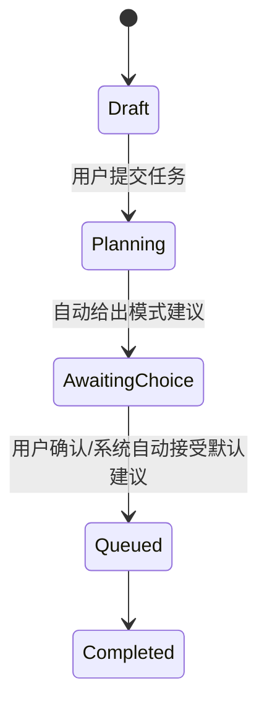
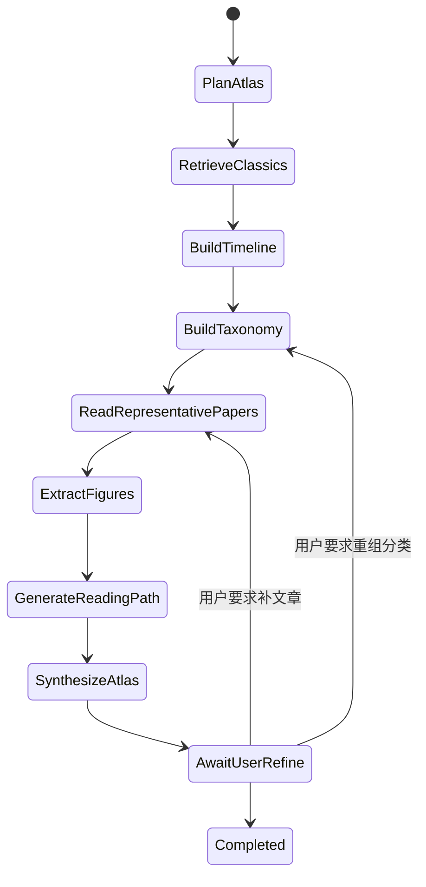
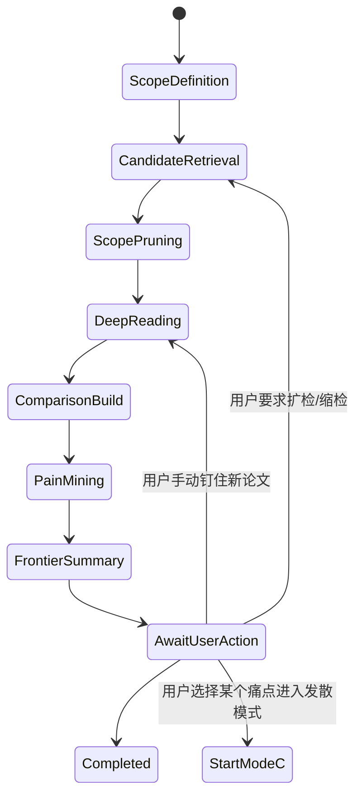
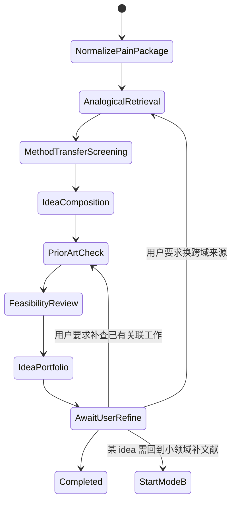

# 07. Runtime Paths, State Machines and API Contracts —— 实时执行路径、状态机与接口契约

版本：v1.0  
日期：2026-03-20  
适用对象：后端工程师、Agent 工程师、前端工程师、测试工程师、平台工程师

---

## 1. 文档目标

本文件回答：

1. 三大模式在运行时到底按什么路径执行。  
2. 用户在哪些节点可以打断、加约束、继续。  
3. 前端如何实时收到研究进度、产物和问题。  
4. 后端 API、事件流、状态机应如何设计。  
5. 如何让 Mode A、B、C 可以相互接力，而不是三个彼此隔离的页面。

本文件是“实现层 runbook”，重点关注实时路径，而非抽象产品愿景。

---

## 2. 统一运行模型

所有模式都建议用统一的 `ResearchRun` 对象承载。

### 2.1 `ResearchRun` 基本字段

- `run_id`
- `workspace_id`
- `mode`：`intake` / `atlas` / `frontier` / `divergent` / `review`
- `parent_run_id`
- `source_run_ids`
- `status`
- `current_stage`
- `progress_percent`
- `config_json`
- `context_bundle_id`
- `output_bundle_id`
- `created_by`
- `created_at`
- `updated_at`

### 2.2 统一状态机

建议统一使用以下状态：

- `draft`
- `planned`
- `queued`
- `running`
- `awaiting_user_input`
- `paused_by_policy`
- `paused_by_user`
- `retrying`
- `completed`
- `failed`
- `cancelled`

### 2.3 统一阶段结构

所有模式的 stage 都建议采用：
- `plan`
- `retrieve`
- `ingest`
- `analyze`
- `synthesize`
- `review`
- `export`

不同模式只是每个阶段内部节点不同。

---

## 3. 事件驱动与实时反馈设计

前端不要频繁轮询所有对象，建议：
- 长任务状态使用 **SSE** 或 **WebSocket** 推流
- 大型资产（图、表、导出文件）使用对象存储 URL + 延迟加载
- 关键节点结果以 event stream 实时回显

## 3.1 推荐事件类型

### 3.1.1 任务生命周期事件

- `run.created`
- `run.planned`
- `run.started`
- `run.paused`
- `run.resumed`
- `run.completed`
- `run.failed`
- `run.cancelled`

### 3.1.2 阶段事件

- `stage.started`
- `stage.progress`
- `stage.completed`
- `stage.failed`

### 3.1.3 研究对象事件

- `paper.added`
- `paper.promoted_to_core`
- `paper.rejected`
- `figure.extracted`
- `cluster.created`
- `pain_point.created`
- `idea.created`
- `timeline.updated`
- `mindmap.updated`
- `comparison.updated`

### 3.1.4 人机交互事件

- `input.requested`
- `scope.tightened`
- `paper.pinned`
- `paper.excluded`
- `mode.transition.suggested`
- `mode.transition.accepted`

## 3.2 事件消息结构建议

```json
{
  "event_id": "evt_123",
  "run_id": "run_001",
  "mode": "frontier",
  "event_type": "paper.added",
  "stage": "retrieve",
  "ts": "2026-03-20T10:21:11Z",
  "payload": {
    "paper_id": "paper_abc",
    "title": "...",
    "reason": "matched benchmark and venue filter"
  }
}
```

---

## 4. 模式 0 的实时路径

## 4.1 状态图



## 4.2 运行步骤

1. 接收用户输入与附件  
2. 对输入做 intent classification  
3. 读取用户画像和历史 workspace  
4. 生成模式建议与理由  
5. 生成初始配置：
   - 目标论文数
   - 年份范围
   - 是否强 venue filter
   - 是否要求图示
   - 是否优先高引用经典 or 近期前沿  
6. 允许用户一键修改  
7. 创建后续 Mode A/B/C 的子 run

## 4.3 用户可交互点

- 直接切换推荐模式
- 补充“我更偏向开题 / 入门 / 综述 / 创新”
- 设定时间预算与输出长度
- 选择是否只看 OA 论文

---

## 5. 模式 A 的实时路径

## 5.1 Mode A 总体状态图



## 5.2 Mode A 详细运行阶段

### A-1 PlanAtlas

输入：
- 领域名
- 若干 seed papers
- 用户背景（beginner / switch-field）

输出：
- 领域定义
- 上下位关系
- 时间范围
- 候选子方向列表
- 预期输出结构

前端反馈：
- “正在识别领域边界”
- “已识别 5 个潜在子方向”

### A-2 RetrieveClassics

执行：
- 检索高引用经典论文
- 检索最近 3~5 年代表工作
- 找图文较友好的代表论文

前端反馈：
- 经典论文候选列表滚动出现
- 每篇带“为何入选”理由

### A-3 BuildTimeline

执行：
- 按年份和 citation influence 构建时间线
- 找出范式切换节点

前端反馈：
- 时间线逐步铺开
- 可点击某节点查看转折原因

### A-4 BuildTaxonomy

执行：
- 构建方法分类树
- 构建任务分类树
- 构建数据模态分类树

前端反馈：
- 左侧知识树更新
- 用户可切换分类视角

### A-5 ReadRepresentativePapers

执行：
- 每个分支精读 1~3 篇代表作
- 抽取问题、方法、创新、数据集、限制

前端反馈：
- 代表论文卡片逐步生成
- 论文卡片上显示“经典 / 最近 / 易懂”标签

### A-6 ExtractFigures

执行：
- 调用 figure service
- 对代表论文提取架构图、结果图或关键表格

前端反馈：
- 图示面板实时补图
- 若图示提取失败，显示“仅文字摘要”降级状态

### A-7 GenerateReadingPath

执行：
- 按入门顺序输出阅读路径
- 输出先修知识
- 给出“第 1 周 / 第 2 周 / 第 3 周”的阅读与理解目标

### A-8 SynthesizeAtlas

执行：
- 汇总为 one-page atlas
- 生成 mind map 数据结构
- 生成后续 Mode B 推荐入口

## 5.3 Mode A 的暂停策略

自动暂停条件建议：
- 无法收敛出稳定分类树
- 文章过于偏向单一路线
- 图示提取成功率太低，需询问用户是否继续只看文字版
- 检索覆盖不足（代表性分支 < 3）

## 5.4 Mode A 到其他模式的跳转

- 点击某个子方向节点 → 生成 Mode B run
- 选中某篇代表论文 → 生成“以该论文为 seed 的 Mode B”
- 选中某个未来方向标签 → 生成 Mode C 预案

---

## 6. 模式 B 的实时路径

## 6.1 Mode B 总体状态图



## 6.2 Mode B 详细运行阶段

### B-1 ScopeDefinition

输入：
- 子领域关键词
- 种子论文
- venue whitelist
- 时间窗
- benchmark/dataset 约束

输出：
- 明确定义什么是“领域内”
- 定义排除项
- 形成 query packs

### B-2 CandidateRetrieval

执行：
- citation chain 检索
- dataset/benchmark 反查
- venue+关键词精检
- 相关度、年份、质量初筛

实时输出：
- 候选论文池
- 每篇的入选原因（命中 benchmark / cited by seed / 顶会等）

### B-3 ScopePruning

执行：
- 删除离题文章
- 删除仅语义相似但任务不同的文章
- 保证 method diversity

用户可操作：
- 排除某 venue
- 排除某应用场景
- 强化某 benchmark
- 只看 OA / 只看顶会 / 只看近三年

### B-4 DeepReading

执行：
- 结构化精读 Top-K
- 提取 method / innovation / experiment / limitation / future work
- 抽图和表

### B-5 ComparisonBuild

执行：
- 生成统一对比矩阵
- 生成方法路线图
- 生成 benchmark 结果面板

### B-6 PainMining

执行：
- 抽取论文 limitation 与 future work
- 聚合 pain points
- 发现缺失评估维度与假设盲区

### B-7 FrontierSummary

执行：
- 生成“小专家总结”
- 给出建议切入点
- 输出可供 Mode C 使用的 pain-point package

## 6.3 Mode B 的自动暂停与回退

暂停条件：
- 相关论文过少（如 < 8 篇高质量候选）
- benchmark 与论文池不一致，说明定义可能过窄
- 精读后发现大量论文并非同一任务定义
- 同质化太严重，系统建议扩大时间窗或扩到邻近 benchmark

回退路径：
- 回到 ScopeDefinition 重新定义
- 回到 CandidateRetrieval 扩检

## 6.4 Mode B 输出 API 契约建议

```json
{
  "subfield_definition": "...",
  "paper_table": [...],
  "benchmark_panel": [...],
  "method_clusters": [...],
  "pain_points": [...],
  "future_work_items": [...],
  "recommended_entry_points": [...],
  "mode_c_seed_package_id": "pkg_001"
}
```

---

## 7. 模式 C 的实时路径

## 7.1 Mode C 总体状态图



## 7.2 Mode C 详细运行阶段

### C-1 NormalizePainPackage

输入：
- 来自 Mode B 的 pain-point package
- 用户手工补充的目标/限制

输出：
- problem signature
- 关键词抽象层次
- 允许跨域范围

### C-2 AnalogicalRetrieval

执行：
- 先按问题签名到其他领域检索
- 再按机制找方法来源
- 返回“相似问题而非相同任务”的候选文章簇

### C-3 MethodTransferScreening

执行：
- 筛选哪些外领域方法值得迁移
- 删除明显依赖不成立假设的方法

### C-4 IdeaComposition

执行：
- 生成若干候选 idea cards
- 每个 idea 卡说明：借了什么、解决哪个痛点、为什么可能有效

### C-5 PriorArtCheck

执行：
- 在目标领域与邻域做反查
- 对高相似思路进行冲突提示

### C-6 FeasibilityReview

执行：
- 检查数据、算力、评估协议是否可落地
- 检查是否能形成最小实验

### C-7 IdeaPortfolio

执行：
- 输出排序后的创新点组合包
- 给每个 idea 生成下一步行动建议

## 7.3 Mode C 的用户交互点

用户可以：
- 限定只向某外领域借方法
- 排除某方法范式
- 只看低资源可行方案
- 要求更激进 / 更保守的创意
- 让系统补做“别人是否已经做过”的更严格检查

## 7.4 Mode C 的输出 API 契约建议

```json
{
  "problem_signature": {...},
  "analogical_domains": [...],
  "transfer_candidates": [...],
  "idea_cards": [...],
  "prior_art_flags": [...],
  "feasibility_notes": [...],
  "recommended_next_actions": [...]
}
```

---

## 8. 模式间上下文传递设计

## 8.1 统一 `ContextBundle`

所有模式之间不应只传文字摘要，而应传结构化 bundle。

字段建议：
- `bundle_id`
- `source_mode`
- `summary_text`
- `selected_papers`
- `paper_clusters`
- `figures`
- `benchmarks`
- `pain_points`
- `future_work_items`
- `mindmap_json`
- `idea_cards`
- `user_annotations`

## 8.2 典型传递案例

### A → B

传递：
- 选中的子方向节点
- 该子方向的代表论文
- 阅读路径上下文
- 用户认为最感兴趣的分支

### B → C

传递：
- pain-point package
- 关键 benchmark
- 主流方法与失败点
- 排除项（哪些路已经太卷或不感兴趣）

### C → B

传递：
- idea card 中的关键词
- 需补查的 prior-art 方向
- 需重点回看的 benchmark / 任务设定

---

## 9. API 设计建议

## 9.1 创建 run

`POST /api/research-runs`

请求体：

```json
{
  "workspace_id": "ws_001",
  "mode": "frontier",
  "input": {
    "topic": "3D anomaly detection",
    "keywords": ["3D anomaly detection", "industrial anomaly detection"],
    "seed_papers": ["paper_1", "paper_2"],
    "constraints": {
      "venues": ["CVPR", "ICCV", "ECCV", "AAAI", "TPAMI"],
      "years": [2021, 2026],
      "need_figures": true,
      "prefer_high_quality": true
    }
  }
}
```

返回：

```json
{
  "run_id": "run_123",
  "status": "queued"
}
```

## 9.2 获取 run 状态

`GET /api/research-runs/{run_id}`

返回：
- 当前阶段
- 进度
- 最新事件
- 当前产出摘要
- 是否等待用户输入

## 9.3 用户中断

`POST /api/research-runs/{run_id}/interrupt`

请求：

```json
{
  "reason": "tighten_scope",
  "payload": {
    "exclude_venues": ["AAAI"],
    "must_include_benchmark": ["MVTec 3D-AD"]
  }
}
```

## 9.4 用户恢复

`POST /api/research-runs/{run_id}/resume`

## 9.5 从结果派生新模式

`POST /api/research-runs/{run_id}/spawn`

请求：

```json
{
  "target_mode": "divergent",
  "context_bundle_id": "bundle_001",
  "selection": {
    "pain_point_ids": ["pain_1", "pain_2"]
  }
}
```

## 9.6 实时事件流

`GET /api/research-runs/{run_id}/events/stream`

SSE 消息示例：

```text
event: paper.added
data: {"paper_id":"p1","title":"..."}
```

---

## 10. 用户交互动作字典

为方便前后端对齐，建议定义固定动作字典：

- `pin_paper`
- `exclude_paper`
- `promote_cluster`
- `demote_cluster`
- `tighten_scope`
- `expand_scope`
- `switch_mode`
- `request_more_figures`
- `request_more_recent_papers`
- `request_more_classics`
- `generate_advisor_summary`
- `send_to_mode_c`
- `recheck_prior_art`

每个动作都必须有：
- 可作用对象
- 可见副作用
- 是否会触发重新执行某个 stage

---

## 11. 策略暂停点（Policy Checkpoints）

系统应在以下节点允许自动停下：

### 11.1 Mode A
- 分类树不稳定
- 代表论文覆盖不足
- 图示提取明显失败

### 11.2 Mode B
- 相关文献不足
- benchmark 定义歧义大
- 召回结果过于发散
- 精读后发现多数论文不是同一任务

### 11.3 Mode C
- 外领域迁移候选过多、过散
- prior-art 风险过高
- 提议无法形成可执行实验

---

## 12. 可观测性与审计字段

每个阶段建议记录：
- 输入 query pack
- 工具调用 trace
- 候选数 / 入选数 / 淘汰数
- 失败原因统计
- token 成本
- 外部 API 调用耗时
- 图示提取成功率
- 用户中断次数
- 最终输出对象数

---

## 13. 测试建议

### 13.1 状态机测试

验证：
- 每个模式都能从 `queued → running → completed`
- 每个模式在 `paused_by_user` 后能恢复
- 失败后支持重试而不产生重复对象

### 13.2 API 契约测试

验证：
- 事件字段稳定
- 前端能正确消费 SSE
- 任何输出 bundle 可被下一个模式消费

### 13.3 用户旅程测试

- 新手从 Mode A 进入 B 再进入 C
- 研究型用户直接从种子论文进入 Mode B
- 高阶用户手动编辑 pain-point package 再进入 Mode C

---

## 14. 实施建议

1. 先实现统一 `ResearchRun`、`ContextBundle`、事件流和中断恢复，再做复杂 Agent。  
2. 先让 Mode A 和 Mode B 能稳定产出结构化结果，再实现 Mode C。  
3. SSE 与对象缓存要先打好，否则前端体验会像“黑盒等待”。  
4. 所有模式间传递都使用 bundle，不要直接拼接自然语言上下文。  
5. 对图示等大资产采用异步补全策略，主报告先可读，图可稍后逐步到位。
